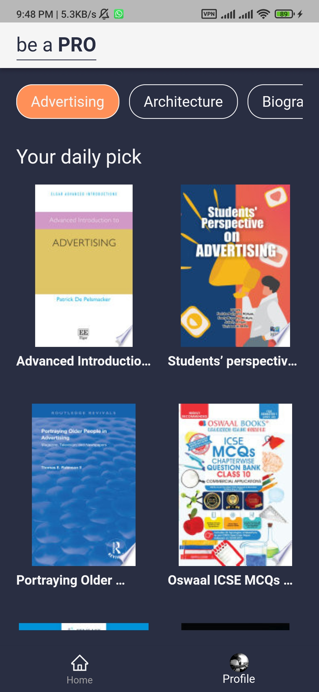
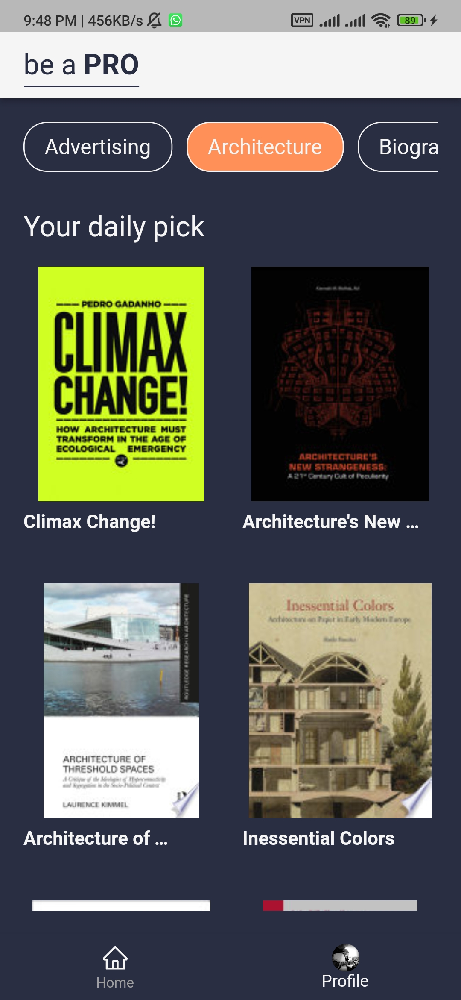
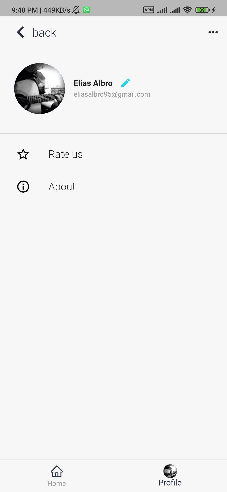
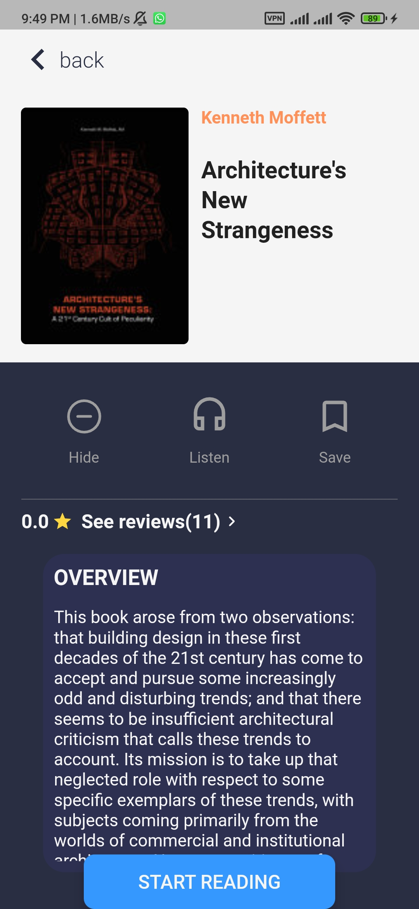

# reading_app
Simple Library App Called "be a PRO"
UI designed by "Inga Sokolova" on Behance 
Link: https://www.behance.net/gallery/109807681/Reading-app-design-UIUX?tracking_source=search_projects%7Cbooks%20app%20mobile

# 📷 Screenshots
| Splash Screen |
|------|------|
||
| Welcome | Google auth|
|------|-------|
|||
| Home | Home |
|------|-------|
|||
| Profile | Book Page |
|------|-------|
|||

## Packages
# Style
Iconify
Flutter Launcher Icon
Flutter Native Splash
Flutte App Name 
Flutter Signin Button
# State Management 
BLoC State Management
# Firebase
Firebase Core
Firebase Auth
Cloud Firestore
Google Sign In

## ✨ Requirements
* Any Operating System (ie. MacOS X, Linux, Windows)
* Any IDE with Flutter SDK installed (ie. IntelliJ, Android Studio, VSCode etc)
* A little knowledge of Dart and Flutter
* A brain to think 🤓🤓

🤓 Author(s)
Elias Lyon Bro©

